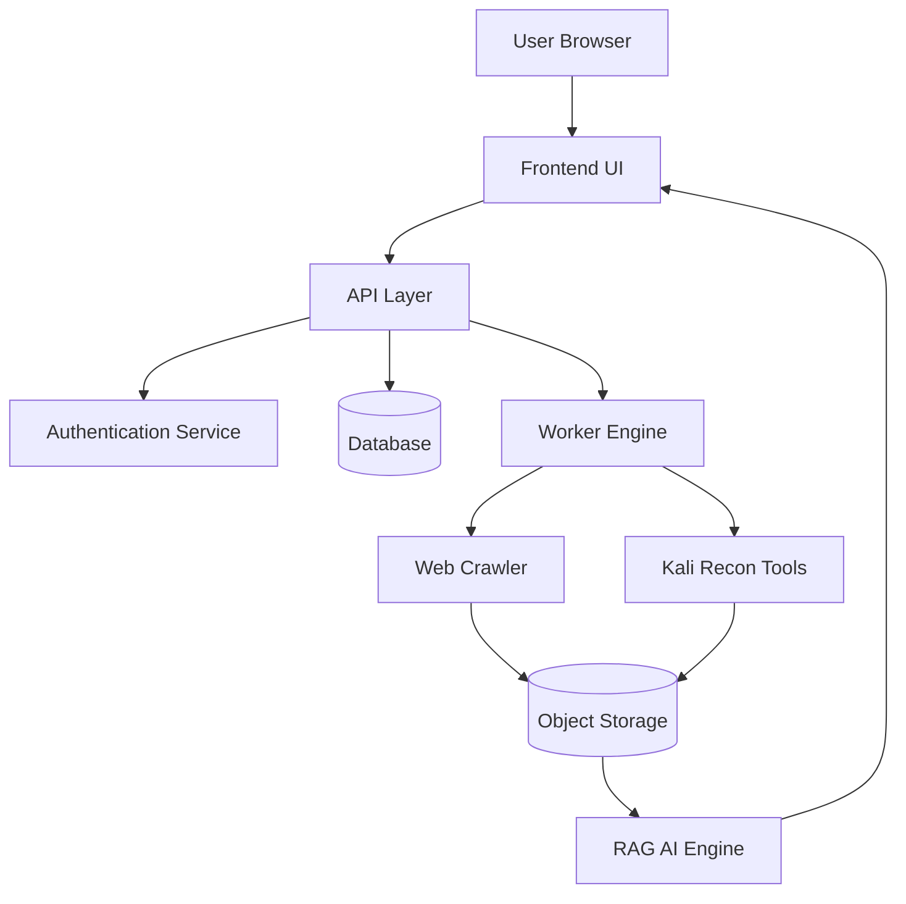
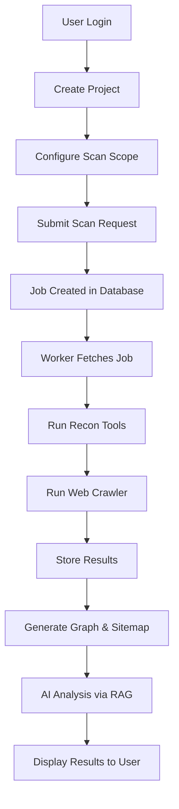
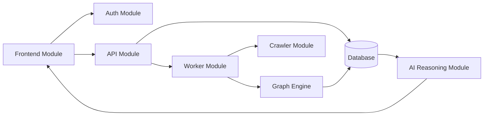
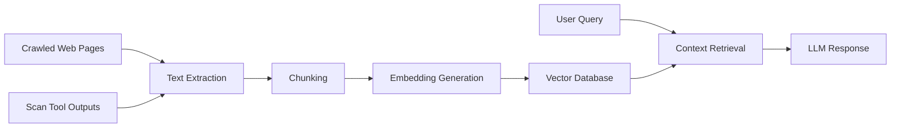
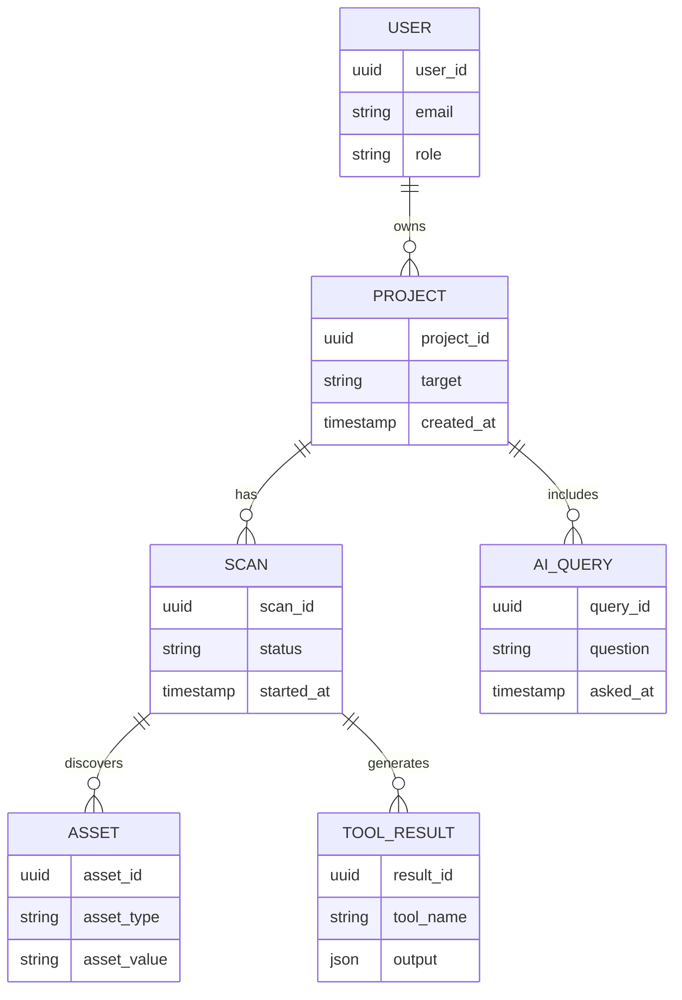
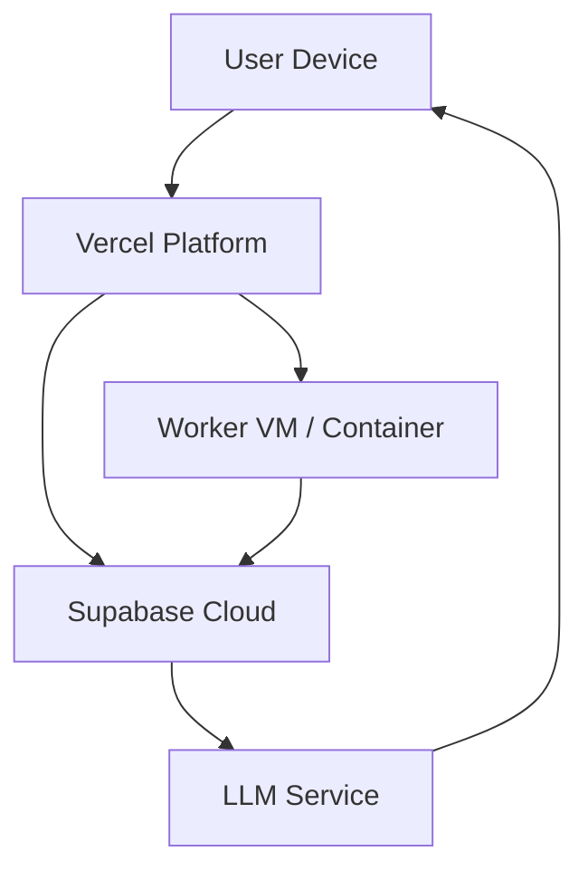

Below is a **single consolidated Markdown document** that contains **all the Mermaid diagrams we created for the AETHER project**, cleaned up and **guaranteed to render without parse errors**.

You can paste this directly into:

* GitHub Markdown
* VS Code Markdown preview
* Mermaid Live Editor
* Any PPT tool that supports Mermaid → image export

---

# **AETHER – System Diagrams (Mermaid)**

---

## **1. System Architecture Diagram**

---

## **2. System Flow Diagram**

---

## **3. Modular Interaction Diagram**

---

## **4. RAG (Retrieval-Augmented Generation) Pipeline Diagram**

---

## **5. Entity Relationship (ER) Diagram**

---

## **6. Deployment Diagram**

---

## **How to Use This**

* **For PPT**:
  Copy each diagram into Mermaid Live → export as PNG → insert into slides.
* **For Project Report**:
  Use screenshots of rendered diagrams under:

  * Chapter 5 (Architecture & Block Diagram)
  * Chapter 6 (System Design)
  * Chapter 8 (Implementation Flow)

If you want next:

* 🎞️ **Slide-wise diagram placement**
* 🧩 **Mermaid diagrams split per chapter**
* 🖼️ **Exact figure captions (IEEE style)**

Just tell me 👍
